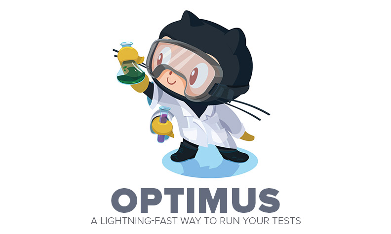

## Introduction

Optimus is a simple way to bind an initial test runner environment using a JavaScript testing framework of your choice. It's highly recommended you care about quality and maintainable codes. Tests are the best way to do that.

**Have fun testing your code. :)**


## What is included?

So far, Optimus includes tests with:

- Mocha (and _chai_)
- Jasmine
- QUnit

> Check the [TODO List](https://github.com/vitorbritto/optimus/issues/1) for next updates.


## Getting Started

### Installation

**1** - First of all, make sure you have [Node.js](http://nodejs.org/) installed. <br/>
**2** - Clone this repository and access the generated folder

```bash
$ git clone git://github.com/vitorbritto/optimus.git [project-name]
$ cd [project-name]
```

**3** - Run the program with: `node optimus` <br/>
**4** - Profit!

### Update Dependencies

All vendor files are added with git submodules or NPM, so you can easily update them.

### Run Tests

**With Makefile:**

Each boilerplate folder contains a _Makefile_ with these tasks:

- `make init-test`: Execute the git submodules.
- `make update-test`: Updates the node packages and / or the git submodules.
- `make watch-test`: Run the test suite and watch for changes.
- `make test`: Run the test suite, with the framework's command line tool or grunt.

**With Grunt:**

The boilerplates also contain [grunt](http://gruntjs.com/) files, so you can easily re-run the tests when files change.

```sh
$ grunt
```


## General Structure

Each boilerplate contains these standard files:

```
.
├── .travis.yml
├── Makefile
├── package.json
└── spec
    ├── index.html
    └── spec.js
```

> Some of these frameworks don't have a grunt plugin. Thus, only makefile will be available to execute the tasks with the framework's command line tool.


## References

**Tools**

- [QUnit](http://qunitjs.com/) - QUnit is a powerful, easy-to-use JavaScript unit testing framework.
- [Mocha](http://visionmedia.github.io/mocha/) - Mocha is a feature-rich JavaScript test framework running on node.js and the browser, making asynchronous testing simple and fun.
- [Jasmine](http://jasmine.github.io/2.0/introduction.html) - BDD, framework independent, easy integration with Ruby projects and continuous builds. Allows for both DOM-less testing and asynchronous testing.
- [Chai](chaijs.com) - Chai is a BDD / TDD assertion library for node and the browser that can be delightfully paired with any javascript testing framework.

**Docs**

- [TDD](http://en.wikipedia.org/wiki/Test-driven_development)
- [BDD](http://en.wikipedia.org/wiki/Behavior-driven_development)
- [AMD](https://github.com/amdjs/amdjs-api/wiki/AMD)
- [CommonJS](http://wiki.commonjs.org/wiki/CommonJS)
- [Unit Testing](http://wiki.commonjs.org/wiki/Unit_Testing/1.0)

**Discussions**

- [Why AMD?](http://requirejs.org/docs/whyamd.html)
- [TDD/JavaScript Unit tests Tools](http://stackoverflow.com/questions/300855/javascript-unit-test-tools-for-tdd)
- [Automated Unit testing with javaScript](http://stackoverflow.com/questions/96066/automated-unit-testing-with-javascript)


## License

[MIT License](http://vitorbritto.mit-license.org/) © Vitor Britto
